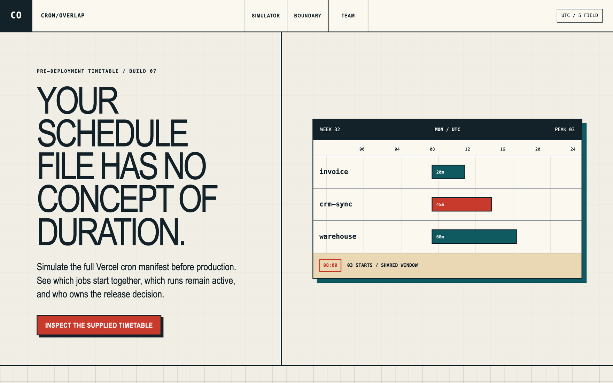

# CronOverlap

CronOverlap simulates a complete Vercel cron manifest before production deployment. Vercel and Next.js teams can see simultaneous starts, assumed execution overlap, self-overlap, high-frequency schedules, duplicate endpoints, missing ownership, and unconfirmed protection in one UTC timetable.

The simulation runs in the browser. It does not upload, persist, or request any scheduled endpoint.



## Local setup

```bash
pnpm install
pnpm dev
```

Open `http://localhost:3000`. The control desk includes a conflict sample, a clear enriched manifest, and a plain `vercel.json` sample.

## Input

Paste either an enriched planning manifest:

```json
{
  "jobs": [
    {
      "name": "billing-digest",
      "path": "/api/cron/billing",
      "schedule": "0 3 * * *",
      "durationMinutes": 20,
      "owner": "billing",
      "protected": true
    }
  ]
}
```

Or paste the `crons` object from `vercel.json`. Plain Vercel entries use a five-minute planning duration, an unassigned owner, and unconfirmed protection until those facts are supplied in an enriched manifest.

Version 0.1 accepts at most 25 jobs, 500,000 JSON characters, standard five-field Vercel cron syntax, UTC reference dates, and a 7- or 14-day horizon.

## Verification

```bash
pnpm verify
pnpm audit --prod
```

The first command checks formatting, ESLint, TypeScript, unit tests, the production build, and the IAMUVIN signature gate.

## Who pays

The free product checks one manifest. Demand, price acceptance, customers, and revenue are unverified.

## Limits

CronOverlap does not prove actual duration, invocation success, CRON_SECRET validation, idempotency, route availability, or downstream capacity. It does not support seconds fields, Quartz extensions, automatic schedule changes, or non-Vercel scheduler semantics. Run production monitoring after deployment.

---

Built by Uvin Vindula — [iamuvin.com](https://iamuvin.com)
